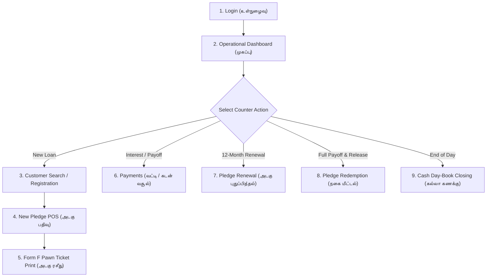

# AS Jewellar Pawn Shop — Counter Operator User Guide (USER-GUIDE.md)
## ஏ.எஸ் ஜூவல்லர்ஸ் — அடகு கடை பயனர் வழிகாட்டி

This guide provides step-by-step instructions for counter operators running daily pawn shop operations in **AS Jewellar Pawn Shop**.

---

## 1. Daily Workflow Overview (செயல்பாட்டு சுருக்கம்)

---

## 2. Step-by-Step Operator Procedures

### Step 1: Admin Login (நிர்வாகி உள்நுழைவு)
1. Open the application on your counter computer or tablet.
2. Enter your **Username** (`admin`) and **Password**.
3. Click **Login (உள்நுழைக)**.
4. *Security Note*: Entering an incorrect password 5 times locks the account for 5 minutes.

---

### Step 2: Operational Dashboard (தினசரி முகப்பு பலகை)
The dashboard displays:
- **Today's Loans Disbursed (இன்று வழங்கப்பட்ட கடன்)**
- **Today's Collections (இன்றைய வசூல்)**
- **Interest Collected (வசூலான வட்டி)**
- **Active Loans & Outstanding Principal (மொத்த நிலுவை கடன்)**
- **Due Today & Overdue Loans (கெடு முடிந்த கடன்கள்)**
- **Live Gold & Silver Rates (தங்க/வெள்ளி நேரடி விலை)**
- Top Bar Status: **🟢 Online (இணையத்தில் உள்ளது)** or **🟠 Offline (ஆஃப்லைன்)**.

---

### Step 3: Customer Search & Registration (வாடிக்கையாளர் பதிவு)
1. Navigate to **Customers (வாடிக்கையாளர்கள்)**.
2. Search by mobile number, name, or Customer ID.
3. If new customer, click **+ Add Customer**:
   - Enter **Full Name in English & தமிழ்** (e.g. `R. Murugan / ஆர். முருகன்`).
   - Enter **10-Digit Mobile Number** (System automatically checks for duplicates).
   - Enter Father's / Husband's Name, Door No, Village/Town, District, and Pincode.
   - Select ID Proof Type (Aadhaar / Voter ID) and enter ID Number.
   - Click **Save Customer (பதிவு செய்க)**.

---

### Step 4: New Pledge POS & Jewellery Appraisal (புதிய அடகு பதிவு)
1. Navigate to **New Pledge POS (புதிய அடகு)**.
2. Select or search the borrower.
3. **Add Jewellery Items (நகைகள் சேர்த்தல்)**:
   - Select Category: `GOLD` or `SILVER`.
   - Select Item Type: `Chain`, `Ring`, `Bangle`, `Necklace`, `Coin`, `Other`.
   - Select Purity: `22K (916 Hallmark)`, `24K`, `18K`, or `SILVER_925`.
   - Enter **Gross Weight (மொத்த எடை)** (e.g. `12.500 g`).
   - Enter **Stone Weight (கல் எடை)** (e.g. `0.200 g`).
   - The system automatically computes:
     $$\text{Net Pure Weight} = \text{Gross Weight} - \text{Stone Weight} = 12.300\text{ g}$$
   - Click **+ Add Item**.
   - Repeat for all jewellery items in the customer's packet.
4. **Approve Loan (கடன் தொகை முடிவு செய்தல்)**:
   - The system computes 100% Market Valuation and maximum **75% Statutory Loan Ceiling**.
   - Enter Approved Loan Amount (e.g. `₹ 1,50,000`).
   - Monthly Interest Rate defaults to `1.0% / month` (12% p.a.).
5. **Assign Physical Safe Coordinates (பெட்டக இருப்பிடம்)**:
   - Select Vault Safe: `Vault A (Main Safe)`.
   - Enter Locker & Tray: `Locker 03 • Tray 12`.
   - Enter Packet Tag ID: `PKT-0089`.
6. Click **Approve & Issue Pawn Ticket (அடகு சீட்டு வழங்குக)**.

---

### Step 5: Printing the Statutory Form F Pawn Ticket (அடகு ரசீது அச்சிடுதல்)
1. Upon saving, the **Bilingual Form F Pawn Ticket Modal** opens automatically.
2. Select Output Mode:
   - **A4 Print Layout**: Standard full-sheet statutory receipt.
   - **80mm Thermal Receipt Layout**: Fast compact counter receipt with transaction QR code.
3. Verify customer and shop details, item weights, and Tamil statutory terms.
4. Click **Print Pawn Ticket (அச்சிடுக)**.
5. Have the borrower sign the counter copy, give the original receipt to the borrower, and place the jewellery in the designated vault packet.

---

### Step 6: Collecting Payments & Interest (வட்டி மற்றும் கடன் வசூல்)
1. Navigate to **Payments (பணம் செலுத்துதல்)**.
2. Enter Ticket No (e.g. `PLG-2026-002341`) or search by borrower mobile.
3. The system calculates exact accrued interest based on elapsed days:
   $$\text{Accrued Interest} = \text{Principal} \times \left(\frac{\text{Monthly Rate}}{100}\right) \times \left(\frac{\text{Days Elapsed}}{30}\right) - \text{Past Interest Paid}$$
4. Choose Payment Allocation:
   - **Interest Only (வட்டி மட்டும்)**: Clears accrued monthly interest; principal stays intact.
   - **Partial Payment (பகுதி தொகை)**: Settle interest first, remainder reduces principal.
   - **Full Settlement (முழு தொகையும் அடைத்தல்)**: Pays off total principal and interest.
5. Select Payment Mode: `CASH`, `UPI` (GPay/PhonePe), or `BANK_TRANSFER`.
6. Click **Record Payment & Print Receipt**.

---

### Step 7: Pledge Renewal (அடகு புதுப்பித்தல் — 12 மாத கால நீட்டிப்பு)
1. Navigate to **Renewal (புதுப்பித்தல்)**.
2. Search active ticket.
3. Collect outstanding accrued interest from borrower.
4. Click **Confirm Renewal & Issue New Ticket**.
5. The system issues a fresh 12-month pawn ticket, marks the old ticket as `RENEWED`, and retains complete immutable historical links.

---

### Step 8: Pledge Redemption & Jewellery Release (நகை மீட்டல்)
1. Navigate to **Redemption (நகை மீட்டல்)**.
2. Search ticket and verify borrower identity against original KYC record.
3. Collect full outstanding balance (Principal + Pending Interest).
4. Verify packet location on screen: `Vault A • Locker 03 • Tray 12 • Packet PKT-0087`.
5. Retrieve physical jewellery packet from the safe.
6. Verify jewellery articles and weights with the customer.
7. Click **Confirm Full Settlement & Release Jewellery**.
8. Print the official **Redemption Receipt** and return jewellery to borrower. The vault packet is automatically marked `VACANT`.

---

### Step 9: Daily Cash Drawer Day-Book Closing (கல்லா கணக்கு சமரசம்)
1. At the end of the counter shift, navigate to **Reports & Cash Day-Book (அறிக்கைகள்)**.
2. Click **Cash Day-Book (கல்லா கணக்கு)** tab.
3. Review the automatic formula:
   $$\text{Expected Closing Cash} = \text{Opening Cash} + \text{Cash Inflows} - \text{Cash Loans Disbursed} - \text{Shop Expenses}$$
4. Enter physical counter cash count (e.g. `₹ 1,02,450`).
5. The system computes daily surplus or shortage variance.
6. Click **Close Daily Cash Day-Book & Save Record**.
7. Click **Export CSV** to save a permanent digital spreadsheet.

---

### Step 10: Working in Offline Mode (இணையம் இல்லாத போது)
- If the shop internet connection disconnects:
  - Top header badge displays **🟠 Offline (ஆஃப்லைன் பயன்முறை)**.
  - You can continue looking up recent customers, appraising jewellery, creating new pledges, and recording payments.
  - All transactions are stored locally in the **IndexedDB Offline Queue** with status `PENDING`.
  - When internet is restored, the system automatically synchronizes the queue to the cloud and updates the status to **🟢 Online (இணையத்தில் உள்ளது)**.
