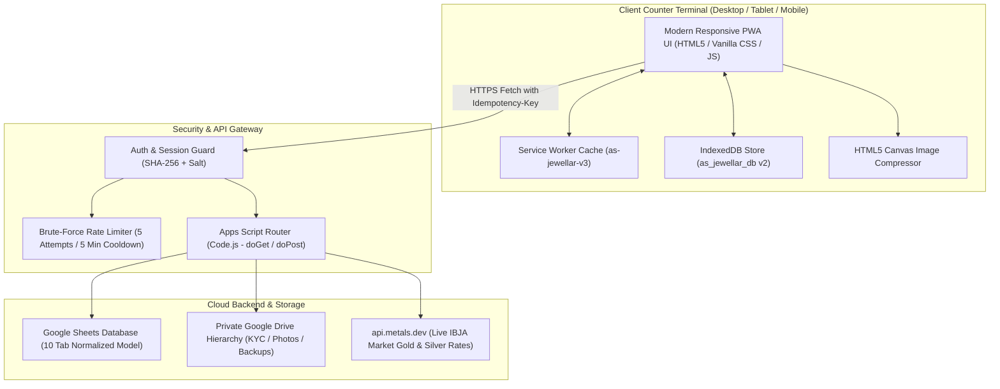

# AS Jewellar Pawn Shop — System Architecture (ARCHITECTURE.md)

This document provides a comprehensive technical overview of the system architecture, component topology, data flows, and state management for **AS Jewellar Pawn Shop**.

---

## 1. High-Level System Architecture

---

## 2. Component Layers & File Map

### A. Frontend Presentation Layer
- **Shell & Navigation**: `index.html`, `login.html`, `dashboard.html`, `app.js`, `ui.js`, `i18n.js`.
- **Counter Workflows**:
  - `customers.html` & `customer.html` (`js/customers.js`): Customer 360 profile, KYC search, duplicate checks.
  - `new-pledge.html` (`js/pledgePos.js`): New Pledge POS, 75% LTV valuation, Form F pawn tickets.
  - `payments.html` (`js/payments.js`): Interest accrual calculator, full & partial payment collections.
  - `renewal.html` & `redemption.html` (`js/renewalRedemption.js`): 12-month tenure renewal, 10-step verified redemption.
  - `reminders.html` (`js/reminders.js`): Dynamic 5-category reminder engine, 1-click WhatsApp messaging.
  - `vault.html` (`js/vault.js`): 4-level vault coordinates, visual locker occupancy grid.
  - `rates.html` (`js/rates.js`): Live IBJA benchmark rate ticker, cached fallback, manual override.
  - `reports.html` (`js/reports.js` & `js/cash.js`): 5 operational reports, cash day-book reconciliation.
  - `documents.html` (`js/documents.js`): Private Drive upload, camera capture, client compression.
  - `settings.html` (`js/offline.js`): Shop licensing, Apps Script URL, IndexedDB sync inspector.

### B. Offline & Resilience Layer
- **Service Worker (`sw.js`)**: Pre-caches 45 application shell assets with Stale-While-Revalidate caching.
- **IndexedDB (`js/offline.js`)**: Manages offline transaction queue (`syncQueue`) with idempotency deduplication and conflict quarantine.

### C. Backend & Cloud Integration Layer
- **Google Apps Script (`backend/` & `api/`)**:
  - `Code.js`: Master dispatcher with strict input validation.
  - `DatabaseService.js`: Google Sheets CRUD, formula injection neutralization (`sanitizeRow`), and automated Drive backups.
  - `AuthService.js`: SHA-256 salted password verification and rate limiting.
  - `RateService.js`: Real-time metal rate proxy and cached fallbacks.
  - `DocumentService.js`: Google Drive folder management and file upload streaming.
  - `AuditService.js`: Immutable audit logging.
  - `ResponseFormatter.js`: Standardized JSON response envelope.

---

## 3. Core Data Flows

### A. New Pledge POS Booking Flow
1. Counter operator selects customer and inputs jewellery articles.
2. System calculates net pure weight ($\text{Net} = \text{Gross} - \text{Stone}$), fetches active per-gram market rate, and computes 75% statutory LTV loan ceiling.
3. Operator assigns physical vault coordinates (`Vault Safe • Locker • Tray • Packet Tag ID`).
4. System generates `Idempotency-Key` and atomic ticket ID (`PLG-YYYY-XXXXXX`).
5. Payload is sent to backend; row is written to `Pledges` and item rows to `PledgeItems`.
6. Event is permanently logged in `AuditLogs`.
7. Form F (Rule 8) bilingual statutory Pawn Ticket modal opens for A4 or 80mm thermal printing.

### B. Single-Drawer Daily Cash Reconciliation Flow
1. Opening physical counter cash is recorded at start of shift.
2. Inflows (`Payments`, `Redemptions`, `Renewals`) automatically credit the drawer.
3. Outflows (`New Loans Disbursed`, `Shop Expenses`) automatically debit the drawer.
4. End of day reconciliation formula:
   $$\text{Expected Closing Balance} = \text{Opening Balance} + \text{Collections} - \text{Loans Disbursed} - \text{Expenses}$$
5. Operator enters physical cash count to compute and document daily variance.
