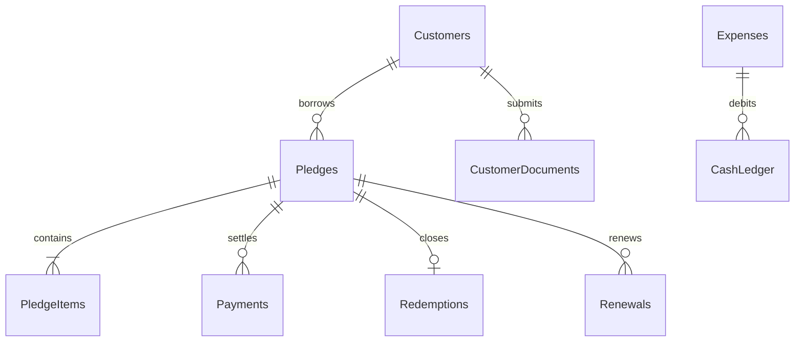

# AS Jewellar Pawn Shop — Database Specification & Migration Protocol (DATABASE.md)

This document specifies the database structure for all 10 Google Sheets tabs backing **AS Jewellar Pawn Shop**, along with non-destructive schema migration protocols.

---

## 1. Ten Core Database Tables

---

## 2. Table Column Reference

### Tab 1: `Customers`
- Primary Key: `customer_id` (`CUS-YYYY-XXXXXX`)
- Columns: `customer_id`, `name_en`, `name_ta`, `father_husband_name`, `gender`, `mobile`, `alt_mobile`, `address`, `town_village`, `district`, `pincode`, `id_type`, `id_number`, `occupation`, `status`, `created_at`, `created_by`.

### Tab 2: `Pledges`
- Primary Key: `ticket_no` (`PLG-YYYY-XXXXXX`)
- Foreign Key: `customer_id` &rarr; `Customers.customer_id`
- Columns: `ticket_no`, `customer_id`, `pledge_date`, `maturity_date`, `tenure_months`, `total_gross_weight`, `total_stone_weight`, `total_net_weight`, `rate_gold_24k`, `rate_gold_22k`, `rate_silver`, `total_estimated_value`, `total_eligible_loan`, `loan_amount`, `monthly_interest_rate`, `monthly_interest_amount`, `status`, `vault_location`, `packet_id`, `locker_tray`, `created_at`, `created_by`.

### Tab 3: `PledgeItems`
- Primary Key: `item_id` (`ITM-PLG-YYYY-XXXXXX-NN`)
- Foreign Key: `ticket_no` &rarr; `Pledges.ticket_no`
- Columns: `item_id`, `ticket_no`, `category`, `item_type`, `description`, `gross_weight`, `stone_weight`, `net_weight`, `purity`, `rate_used`, `estimated_value`, `eligible_loan`, `approved_loan`, `created_at`.

### Tab 4: `Payments`
- Primary Key: `payment_id` (`PAY-YYYY-XXXXXX`)
- Foreign Key: `ticket_no` &rarr; `Pledges.ticket_no`
- Columns: `payment_id`, `ticket_no`, `amount`, `payment_type`, `payment_mode`, `reference_no`, `principal_settled`, `interest_settled`, `remaining_principal`, `status`, `created_at`, `created_by`.

### Tab 5: `Redemptions`
- Primary Key: `redemption_id` (`RED-YYYY-XXXXXX`)
- Foreign Key: `ticket_no` &rarr; `Pledges.ticket_no`
- Columns: `redemption_id`, `ticket_no`, `customer_id`, `principal_settled`, `interest_settled`, `total_settlement`, `payment_mode`, `packet_id`, `redemption_date`, `redeemed_by`.

### Tab 6: `Renewals`
- Primary Key: `renewal_id` (`REN-YYYY-XXXXXX`)
- Foreign Key: `old_ticket_no` &rarr; `Pledges.ticket_no`, `new_ticket_no` &rarr; `Pledges.ticket_no`
- Columns: `renewal_id`, `old_ticket_no`, `new_ticket_no`, `customer_id`, `interest_settled`, `principal_carried`, `renewal_date`, `new_maturity_date`, `processed_by`.

### Tab 7: `Expenses`
- Primary Key: `expense_id` (`EXP-YYYY-XXXXXX`)
- Columns: `expense_id`, `date`, `category`, `amount`, `description`, `payment_method`, `created_at`, `created_by`.

### Tab 8: `CashLedger`
- Primary Key: `cash_tx_id` (`CSH-YYYY-XXXXXX`)
- Columns: `cash_tx_id`, `date`, `entry_type`, `reference_id`, `amount`, `description`, `created_by`.

### Tab 9: `CustomerDocuments`
- Primary Key: `doc_id` (`DOC-YYYY-XXXXXX-NN`)
- Foreign Key: `customer_id` &rarr; `Customers.customer_id`
- Columns: `doc_id`, `customer_id`, `pledge_id`, `doc_type`, `doc_title`, `stored_filename`, `drive_file_id`, `file_size_bytes`, `mime_type`, `status`, `created_at`, `uploaded_by`.

### Tab 10: `AuditLogs`
- Primary Key: `audit_id` (`AUD-YYYY-XXXXXX`)
- Columns: `audit_id`, `actor_id`, `action`, `entity_type`, `entity_id`, `previous_state`, `new_state`, `device_meta`, `timestamp`.

---

## 3. Database Migration & Governance Rules

> [!CAUTION]
> **Zero-Loss Database Rules**:
> 1. **Never Rename or Delete Existing Columns**: Adding new fields must always be done by appending new columns to the end of the tab.
> 2. **Never Overwrite Historical Data**: Financial records in `Payments`, `CashLedger`, `Redemptions`, and `Renewals` are strictly append-only.
> 3. **Neutralize Formula Injections**: All incoming string values starting with `=`, `+`, `-`, `@`, `\t`, `\r` are neutralized by prepending `'` via `DatabaseService.sanitizeValue()`.
> 4. **Backup Before Schema Updates**: Always trigger a snapshot clone via `DatabaseService.createDailyBackup("MIGRATION")` prior to applying structural alterations.
