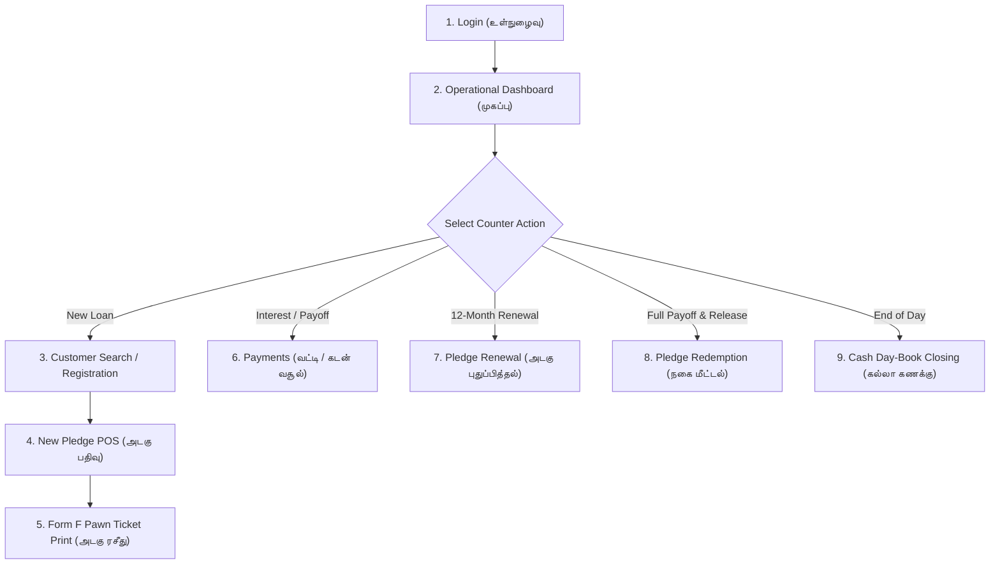

# AS Jewellar Pawn Shop — Counter Operator Manual (USER-GUIDE.md)
## ஏ.எஸ் ஜூவல்லர்ஸ் — அடகு கடை பயனர் வழிகாட்டி

This guide provides complete instructions for counter operators running daily pawn shop operations in **AS Jewellar Pawn Shop**.

---

## 1. Daily Workflow Overview (செயல்பாட்டு சுருக்கம்)

---

## 2. Step-by-Step Counter Procedures

### Step 1: Admin Login (நிர்வாகி உள்நுழைவு)
1. Open the application on your counter PC.
2. Enter **Username** (`admin`) and **Password**.
3. Click **Login (உள்நுழைக)**.
4. *Security*: 5 failed attempts trigger a 5-minute lockout.

### Step 2: Dashboard Overview (முகப்பு பலகை)
- Review today's loans, collections, active loans, and overdue counts.
- Verify live metal rates ticker and connectivity status (**🟢 Online** / **🟠 Offline**).

### Step 3: Customer Search & Registration (வாடிக்கையாளர் பதிவு)
- Search by 10-digit mobile or name.
- If new, enter bilingual names (English + தமிழ்), mobile, residential address, and ID proof (Aadhaar / Voter ID).

### Step 4: New Pledge POS & Jewellery Appraisal (புதிய அடகு பதிவு)
- Select customer & add jewellery articles (`Category`, `Item Type`, `Purity`, `Gross Weight`, `Stone Weight`).
- System computes pure net weight, market valuation, and **75% Statutory Loan Ceiling**.
- Enter Approved Loan Amount (e.g. `₹ 1,50,000`) and interest rate (`1.0% / month`).
- Assign physical safe coordinates (`Vault A • Locker 03 • Tray 12 • PKT-0089`).
- Click **Approve & Issue Pawn Ticket**.

### Step 5: Printing Bilingual Form F Pawn Ticket (அடகு ரசீது)
- Print **A4 Full Sheet** or **80mm Thermal Receipt** with transaction QR code.
- Have borrower sign counter copy; store original with vault packet.

### Step 6: Collecting Payments & Interest (வட்டி மற்றும் கடன் வசூல்)
- Search ticket; system calculates exact accrued interest based on elapsed days.
- Choose: `INTEREST_ONLY`, `PARTIAL`, or `FULL_SETTLEMENT`.
- Record payment via `CASH`, `UPI`, or `BANK_TRANSFER` and print payment receipt.

### Step 7: Pledge Renewal (அடகு புதுப்பித்தல்)
- Collect accrued interest and extend loan tenure by 12 months with chained audit history.

### Step 8: Pledge Redemption & Jewellery Release (நகை மீட்டல்)
- Verify borrower KYC, collect full payoff, retrieve physical packet from safe, verify items with customer, update locker to `VACANT`, and print Redemption Receipt.

### Step 9: Daily Cash Day-Book Closing (கல்லா கணக்கு)
- Review daily formula ($\text{Opening} + \text{Inflow} - \text{Outflow} - \text{Expenses} = \text{Closing}$), enter physical cash count, and export permanent CSV spreadsheet.
